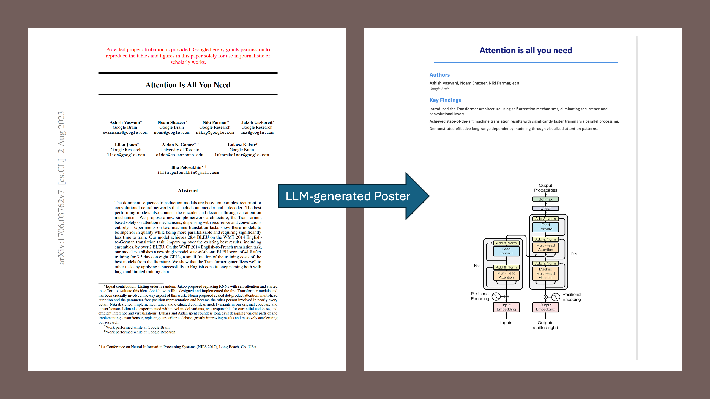

# Academic Poster Generator with MCP

An automated poster generation system that extracts content from academic PDFs and creates professional PowerPoint posters using AI. Built with Model Context Protocol (MCP), Ollama, and local LLMs.


*Example: Converting attention_is_all_you_need.pdf to 1-page poster.*

## 🎯 Features

- **Automatic PDF Analysis**: Extracts text and images from academic papers
- **AI-Powered Summarization**: Uses Qwen 3 to generate structured summaries
- **Professional Poster Creation**: Generates vertical academic posters (24" × 36") in PowerPoint format
- **Structured Content**: Automatically organizes title, authors, affiliations, key findings, and images

## 📋 Prerequisites

- **Python**: 3.9 or higher
- **Go**: Latest version (for mcphost)
- **RAM**: At least 16GB recommended (for running Qwen 3 30B)
- **Disk Space**: ~20GB for models
- **Operating System**: macOS, Linux, or Windows

## 🚀 Installation

### Step 1: Clone or Create Project Directory

```bash
# Create project directory
mkdir poster-generator
cd poster-generator

# Create subdirectories
mkdir data config
```

### Step 2: Set Up Python Virtual Environment

```bash
# Install uv and create virtual environment
curl -LsSf https://astral.sh/uv/install.sh | bash  # Mac/Linux
uv venv

# Activate virtual environment
# On macOS/Linux:
source .venv/bin/activate

# On Windows:
# .venv\Scripts\activate
```

### Step 3: Install Python Dependencies

```bash
# Upgrade pip
uv pip install --upgrade pip

# Install required packages
uv pip install -r requirements.txt
```

### Step 4: Install Go (if not already installed)

Download go from https://go.dev/doc/install

```bash
# Verify installation
go version
```

### Step 5: Install mcphost

```bash
# Install mcphost
go install github.com/mark3labs/mcphost@latest

# Add Go bin to PATH (if not already)
export PATH=$PATH:$HOME/go/bin

# On Windows, add to PATH:
# %USERPROFILE%\go\bin

# Verify installation
mcphost --version
```

### Step 6: Install Ollama

#### macOS
```bash
# Download and install from website
# Visit: https://ollama.ai/download

# Or using Homebrew
brew install ollama
```

#### Linux
```bash
curl -fsSL https://ollama.ai/install.sh | bash
```

#### Windows
```bash
# Download installer from: https://ollama.ai/download
```

**Verify Ollama installation:**
```bash
ollama --version
```

### Step 7: Pull Required Models

```bash
# Start Ollama service (if not auto-started)
ollama serve &

# Wait a few seconds, then pull models
# Pull Qwen 3 30B (main reasoning model) - ~18GB download
ollama pull qwen3:30b

# Or use smaller version if RAM limited:
# ollama pull qwen2.5:7b

# Verify models are installed
ollama list
```

You should see:
```
NAME            ID          SIZE    MODIFIED
qwen3:30b       abc123...   18GB    2 minutes ago
```

## 📁 Project Structure

```
poster-generator/
├── .venv/                      # Virtual environment
├── data/                       # Place your PDF files here
├── config/
│   └── mcphost.json           # MCP configuration
├── generate_poster.py          # Main MCP server script
├── utils.py                    # Poster creation utilities
├── .debug_mcp.log             # Debug logs
└── README.md                   # This file
```

## ⚙️ Configuration

### Create MCP Configuration File

Create `config/mcphost.json`:

```json
{
  "mcpServers": {
    "generate_poster": {
      "command": "/absolute/path/to/your/project/.venv/bin/python3",
      "args": [
        "/absolute/path/to/your/project/generate_poster.py"
      ]
    }
  }
}
```

**Important**: Replace `/absolute/path/to/your/project/` with your actual project path.

To get your absolute path:
```bash
# Run this in your project directory
pwd
# Copy the output and use it in the config
```

Example on macOS:
```json
{
  "mcpServers": {
    "generate_poster": {
      "command": "/Users/yourname/poster-generator/.venv/bin/python3",
      "args": [
        "/Users/yourname/poster-generator/generate_poster.py"
      ]
    }
  }
}
```

### Add Your Python Scripts

Copy your `generate_poster.py` and `utils.py` files to the project directory.

### Optional: Create .env File

Create `.env` in the project root (if you need environment variables):
```bash
# Optional configuration
OLLAMA_HOST=http://localhost:11434
```

## 🎬 Running the System

### Step 1: Start Ollama

```bash
# Make sure Ollama is running
ollama serve

# Keep this terminal open
```

### Step 2: Pre-load the Model (Recommended)

In a new terminal:
```bash
# Pre-load Qwen to avoid timeout issues
ollama run qwen3:30b "Hello, ready to generate posters"

# Exit with: /bye
```

### Step 3: Start mcphost

In another terminal (with virtual environment activated):
```bash
# Navigate to project directory
cd poster-generator

# Activate virtual environment
source .venv/bin/activate

# Run mcphost
mcphost -m ollama:qwen3:30b --config config/mcphost.json
```

You should see:
```
MCP Host started successfully
Connected to generate_poster MCP server
Ready for input...
```

## 💬 Using the Poster Generator

### Example Prompts

Once mcphost is running, you can use natural language prompts:

#### Basic Usage
```
Create a poster from the PDF in the data folder
```

#### Specific File
```
Generate a poster from data/paper.pdf
```

#### With Description
```
Read the paper in data/research.pdf and create an academic poster
```

### What Happens:

1. **PDF Analysis**: Extracts text and images from your PDF
2. **AI Summarization**: Qwen generates structured summary with:
   - Paper title
   - Authors and affiliations
   - Publication venue
   - Key findings (bullet points)
3. **Poster Creation**: Creates a professional PowerPoint poster
4. **Output**: Saves as `{paper_title}.pptx` in your project directory

### Sample Workflow

```bash
# 1. Place your PDF in the data folder
cp ~/Downloads/my_paper.pdf data/

# 2. Start the generation
You: Create a poster from my_paper.pdf in the data folder

# 3. Wait for processing (30-60 seconds)
# The system will:
# - Extract text and images
# - Generate summary with Qwen
# - Create PowerPoint poster

# 4. Output
AI: Success creating poster!

# 5. Find your poster
ls -la *.pptx
```

## 🔧 Troubleshooting

### Issue: mcphost hangs on "Loading model..."

**Solution:**
```bash
# Unload all models and restart
killall ollama
ollama serve &
sleep 5
ollama run qwen3:30b "test"
# Exit with /bye
mcphost -m ollama:qwen3:30b --config config/mcphost.json
```

### Issue: "Model not found"

**Solution:**
```bash
# Check installed models
ollama list

# Pull the model if missing
ollama pull qwen3:30b
```

### Issue: Out of memory

**Solution 1:** Use smaller model
```bash
ollama pull qwen2.5:7b
mcphost -m ollama:qwen2.5:7b --config config/mcphost.json
```

**Solution 2:** Close other applications to free RAM

### Issue: MCP server fails to start

**Solution:**
```bash
# Check the log file
tail -f .debug_mcp.log

# Test the script directly
python generate_poster.py

# Verify Python path in config
which python3
# Update config/mcphost.json with correct path
```

### Issue: "Connection refused" to Ollama

**Solution:**
```bash
# Check if Ollama is running
curl http://localhost:11434/api/tags

# If not, start it
ollama serve
```

### Issue: Generated poster has errors

**Solution:**
```bash
# Check the debug log
tail -50 .debug_mcp.log

# Verify PDF has extractable text
python -c "from pypdf import PdfReader; print(PdfReader('data/your.pdf').pages[0].extract_text())"
```

## 📊 System Requirements

### Minimum
- **CPU**: 4 cores
- **RAM**: 16GB
- **Disk**: 20GB free space
- **Model**: qwen2.5:7b

### Recommended
- **CPU**: 8+ cores
- **RAM**: 32GB
- **Disk**: 50GB free space
- **Model**: qwen3:30b

## 🛠️ Advanced Configuration

### Environment Variables

You can configure Ollama's behavior:

```bash
# Limit number of loaded models
export OLLAMA_MAX_LOADED_MODELS=1

# Set model keep-alive time
export OLLAMA_KEEP_ALIVE=5m

# Limit parallel requests
export OLLAMA_NUM_PARALLEL=1

# Then restart Ollama
killall ollama
ollama serve
```

### Custom Model Settings

Edit the request in `generate_poster.py`:

```python
summary_response = requests.post(
    "http://localhost:11434/api/generate",
    json={
        "model": "qwen3:30b",
        "prompt": summary_prompt,
        "stream": False,
        "options": {
            "temperature": 0.0,      # Lower = more deterministic
            "top_p": 0.9,            # Nucleus sampling
            "top_k": 40,             # Top-k sampling
        }
    },
    timeout=120  # Increase for complex papers
)
```

## 📧 Support

For issues:
1. Check `.debug_mcp.log`
2. Review troubleshooting section
3. Check Ollama logs: `~/.ollama/logs/server.log`

---

**Happy Poster Generating! 🎨📊**
